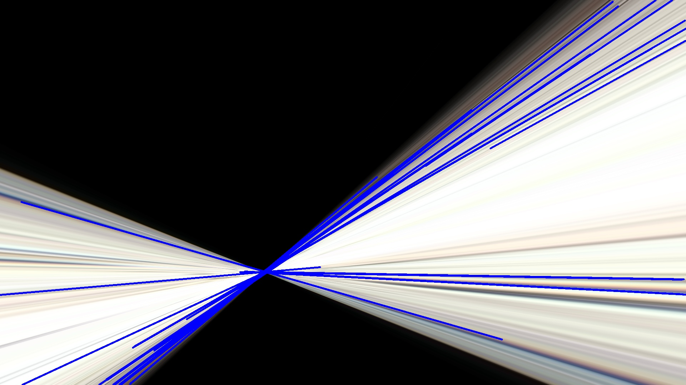

## Using Homography to align a video of thin sections taken with a smartphone (moto g6) in a petrographical microscope

The idea was to test the homography algorithm given by open-cv to align a rotating image of a thin section (main case: pleochroism of phlogopite, but uploaded another videos just to see how far it could go).

The program takes a video, divides into frames, aligns the frames and then using a Hough transform to discard useless images (see below for an example); finally it merges the aligned images into a gif.

## Gif without homography (Shaky)

## Gif with homography applied (not so Shaky, pleochroism!)

## On rejected images

So, the algorithm isn't  perfect, big surprise, but I attempted to catch this misaligned (like really really bad alignment, just see) with a Hough line transform, basically if the Hough transform detects too many, too long straight lines it doesn't count the image as it probably looks like this:

So that's it for now, hope it may be of use!

### References

- Richard O. Duda and Peter E. Hart (1972). Use of the Hough Transformation to detect lines and curves in pictures. Graphics and Image Processing 15 

https://livecodestream.dev/post/2020-05-26-hough-transformation/

https://www.learnopencv.com/homography-examples-using-opencv-python-c/

